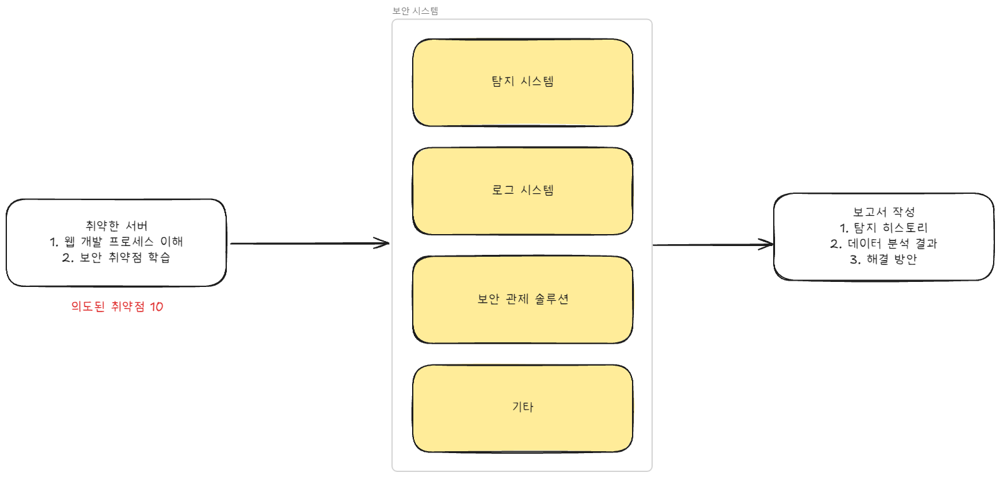
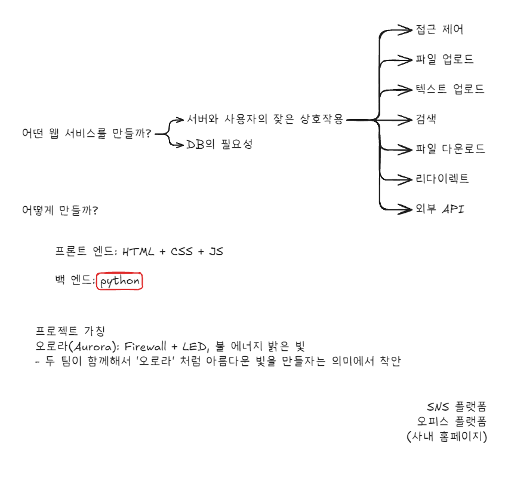

# Aurora Project
> Team Firewalls. N LED Team. First Collaboration Project. 2024.12.10  
> 두 팀이 가진 폭발적인 에너지를 오로라 처럼 아름답게 표현하자.

## 목차

* [프로젝트 개요](#project-overview)
* [기술 스택](#technology-stack)
* [프로젝트 구조](#project-structure)
* [프로젝트 플로우-차트](#project-flowchart)
* [프로젝트 실행 방법](#how-to-run-project)
* [라이선스](#license)

## Project Overview

Aurora는 사이버 보안 교육을 위한 취약한 웹 애플리케이션 플랫폼입니다.  
Django 웹 프레임워크를 기반으로 하며, MariaDB를 데이터베이스로 사용하고 Docker를 통해 컨테이너화되어 있습니다.

### 🎯 프로젝트 목표


1. **보안 학습 환경 구축**
   - 의도적으로 취약한 웹 서버 구축
   - 실제 공격/방어 시나리오 체험
   - 웹 개발 보안 취약점 실습

2. **보안 도구 개발**
   - 공격 탐지 시스템 구현
   - 방어 솔루션 구축
   - 로그 모니터링 시스템 개발

3. **실무 역량 강화**
   - 보안 문서 작성 능력 향상
   - 문제 해결 능력 개발
   - 팀 협업 경험

### 🏆 해킹 방어 대회 (2024.12.20)

**대회 요구사항**
1. **웹 서버**
   - 최소 10개 이상의 취약점 포함

2. **모바일 앱**
   - 취약한 안드로이드 앱 개발
   - 게임 또는 유틸리티 앱

3. **보안 시스템**
   - 침입 탐지 시스템
   - 로그 수집/분석 시스템
   - 보안관제 솔루션

**대회 방식**
- **참가 팀**: Firewall-LED(7명) vs NIS-Caffeine(7명)
- **승리 조건**: Root 권한 또는 Root Shell 획득
- **진행 방식**: 실시간 공격/방어 동시 진행

### 💡 프로젝트 아이디어


## technology-stack
| 구분 | 기술 |
|------|------|
| Frontend |    |
| Backend |  |
| Database |  |
| Container |  |
| Web Server |   |

## project-structure
```
Aurora/
├── Aurora/               # → Django 프로젝트 메인 디렉토리(프런트)
├── Django/               # → Django 애플리케이션 디렉토리(서버)
├── Maria/                # → MariaDB 관련 설정(데이터베이스)
├── .github/              # → GitHub 워크플로우 설정
├── manage.py             # → Django 프로젝트 관리
├── requirements.txt      # → Python 의존성
├── Dockerfile             # → Docker 이미지 정의
├── docker-entrypoint.sh   # → Docker 진입점 스크립트
├── run.bat                # → Windows 실행 스크립트
└── run.sh                 # → Linux/Mac 실행 스크립트
```

## how-to-run-project
- 간편 실행 방법
```bash
$ git clone <repository-url>
$ cd Aurora
$ ./run.bat 
# 또는 ./run.sh (환경에 맞게)
```

- docker hub 이미지 실행
```bash
# 기본 실행
$ docker run -d --name aurora -p 80:80 krjaeh0/aurora:latest

# (선택사항) 소스코드 변경사항을 실시간으로 반영하려면:
$ docker run -d --name aurora -p 80:80 -v "%cd%/Aurora:/app/Aurora" krjaeh0/aurora:latest
```

3. 접속
- 웹 브라우저에서 http://localhost 또는 http://127.0.0.1 접속
- 관리자 페이지: http://localhost/admin
- 

## license
이 프로젝트는 MIT 라이선스 하에 배포됩니다.  
자세한 내용은 [LICENSE](LICENSE) 파일을 참조하세요.

- 자유로운 사용, 수정, 배포 가능
- 상업적 이용 가능
- 원저작자 표시 필요